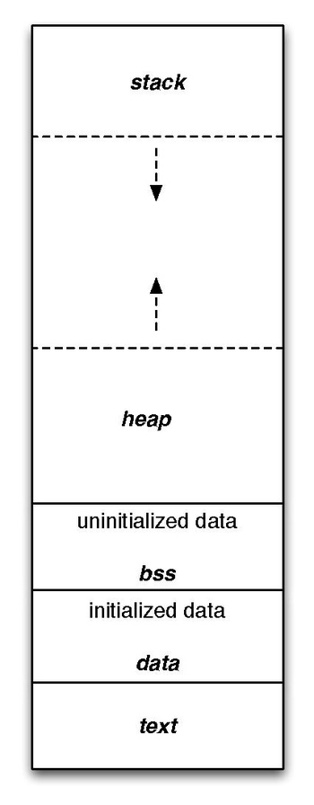

# Ponteiros e Gerenciamento de Memória

------

## Pré-Requisitos

São requisitos para essa aula o conhecimento de:

- Introdução/Fundamentos de Programação (em alguma linguagem de programação)
- Interesse em aprender C/C++
- Compreensão dos tipos básicos em C/C++ (incluindo tipos agregados)
- Escopo de variáveis locais e globais
- Familiaridade com uso e instalação de compiladores/IDEs ou uso de ferramentas de programação online

------

## O que são ponteiros?

A memória principal do computador, também conhecida como Random Access Memory (RAM),
é onde reside o programa e seus dados de execução.
Cada posição da memória é denominada um *endereço de memória*.

Em C/C++, um tipo ponteiro é acompanhado de um asterisco (*), enquanto o operator & é utilizado para extrair o endereço de uma variável.

```{.cpp}
int  x   = 5;   // armazena o inteiro 5 na variável x
int* px  = &x;  // armazena o endereço de x na variável px
char y   = 'A'; // armazena o caractere 'A' na variável y
char* py = &y;  // armazena o endereço de y na variável py
```

Abordamos ponteiros de uma maneira bastante simples e direta: *ponteiros são apenas números (que indicam endereços de memória)*.

Portanto, não há o que temer! Sempre que encontrar um tipo ponteiro, imagine que ele é um número (e ele realmente é!).

```{.cpp}
int  ppy = &y; // mas... o compilador pode (e deve) reclamar
```

-------

## Motivação: strings em memória

Exploramos a situação dos strings, ou cadeias de caracteres, em C/C++.
Como não existe um tipo primitivo, podemos utilizar vetores ou ponteiros de caracteres.

```{.cpp}
char        texto1[] = "Primeiro texto"; 
const char* texto2   = "Segundo texto";
```

Em ambos exemplos acima, temos acesso a uma cadeia de caracteres nas variáveis *texto1* e *texto2*.
Embora exista uma diferença fundamental na estrutura das duas strings, ambas podem ser vistas como um *ponteiro para caractere*
(observe que, em *texto2*, se trata de um ponteiro para informações imutáveis/constantes).

Naturalmente, o comando `printf("'%s' e '%s'. %p %p", texto1, texto2, texto1, texto2);` irá apresentar na tela: `'Primeiro texto' e 'Segundo texto'.`, seguido dos endereços de memória (números!) para *texto1* e *texto2*.

-------

## Organização da memória

::::::::: {.columns}

:::: {.column width=70%}

Para observar a diferença entre diversos tipos de alocações de memória, precisamos compreender como é organizada em C/C++.


Um programa em C/C++ armazena suas informações em segmentos de memória denominados: *text*, *data*, *bss*, *heap* e *stack*.
No segmento *text*, as próprias instruções do código são armazenadas, seguidas dos dados inicializados (*data*) e dados não inicializados (*bss*). A seguir, o *heap* se expande dos menores para maiores endereços, enquanto a pilha (*stack*) cresce na direção oposta.

::::

:::: {.column width=30%}

{width=70%}
[Wikipedia CC-SA-BY](https://en.wikipedia.org/wiki/Data_segment)
::::

:::::::::

-------

## Variáveis (e endereços) na memória

Considere o código compilado `gcc main.c -o app`:

::::::::: {.columns}

:::: {.column width=50%}

```{.cpp}
#include<stdio.h>
int main() {
  return 0;
}
```

::::

:::: {.column width=50%}

No Linux, `size app` resulta em:

```
text	   data	    bss	  dec
1434	    544	      8	 1986
```

::::

:::::::::


Agora considere:

::::::::: {.columns}

:::: {.column width=50%}


```{.cpp}
#include<stdio.h>
long global; // ou int64_t
long global2 = 65;

int main() {
  char        texto1[] = "Primeiro texto"; 
  const char* texto2   = "Segundo texto";
  long local = 66;
  return 0;
}
```

::::

:::: {.column width=50%}

No Linux, `size app` resulta em:

```
text	   data	    bss	  dec
1701	    608	     16	 2325
```

::::

:::::::::

------


## Variáveis (e endereços) na memória (parte II)


::::::::: {.columns}

:::: {.column width=35%}


```{.cpp}
#include<stdio.h>
long global;
long global2 = 65;

int main() {
  char   texto1[] = 
    "Primeiro texto"; 
  const char* texto2 = 
    "Segundo texto";
  long local = 66;
  return 0;
}
```

::::

:::: {.column width=65%}

No Linux, `readelf -x .data app`:

```
Hex deposito da seção '.data':
  0x00004000 000000... .........@......
  0x00004010 410000... A.......
```

` `

No Linux, `readelf -x .rodata app`:

```
Hex deposito da seção '.rodata':
  0x00002000 010000... ....Segundo text
  0x00002010 6f00      o.

```

` `

No Linux, `readelf -x .text app |` `grep Primeiro`:

```
  0x00001160 45f83... E.1.H.PrimeiroH.
```

::::

:::::::::

------

## Variáveis (e endereços) na memória (parte III)

Portanto, o armazenamento da variável pode ser feito em espaços (estáticos) distintos da memória (alguns de somente leitura): 

```{.cpp}
#include<stdio.h>
long global;
long global2 = 65;

int main() {
  char        texto1[] = "Primeiro texto"; 
  const char* texto2   = "Segundo texto";

  char* texto3 = texto1;                    // OK
  char* texto4 = (char*)texto2;             // OK
  texto3[0] = 'Z';                          // OK
  texto4[0] = 'Z';                          // ERRO
  return 0;
}

```

------


## Navegação por Ponteiros

Os parâmetros são sempre copiados (em C) ao serem passados para uma função ou
procedimento. Como passar tipos complexos (estruturas e
vetores de muitos elementos) sem perder tempo?

Lembrando que a sintaxe do ponteiro simplesmente inclui um asterisco (*)
após o tipo da variável. **Exemplos:** `int* x; struct P* p1;`

Um ponteiro simplesmente armazena **o local** (endereço) onde determinada variável
está armazenada na memória (basicamente, um número).
Então quando um ponteiro é passado
como parâmetro, **a cópia do ponteiro** pode ser utilizada para
encontrar na memória a estrutura desejada.

O tamanho do ponteiro varia de acordo com a arquitetura, mas para endereçar 64-bits, ele ocupa 8 bytes.

------

## Navegação por Ponteiros (parte II)

Em ponteiros para agregados, o operador de acesso (.) é substituído por uma seta (->). O operador `&` toma o endereço da variável:

```{.cpp}
struct P { 
   int x;
   char y;
};

void imprimir(struct P* p3, struct P p4) {
   printf("%d %d\n", p3->x, p4.x);
   p3->x = 10; p4.x = 10;
}
// ...
struct P p0 = {.x = 20, .y = 'Y'}; // cria variável 'p0'
struct P p1 = {.x = 20, .y = 'Y'}; // cria variável 'p1'
imprimir(&p0, p1);                 // resulta em '20 20'
printf("%d %d\n", p0.x, p1.x);     // resulta em '10 20'
```

------

## Navegação por Ponteiros (parte III)

```
      48             20  Y                   24
---------------------------------------------------------
0  4  8  12  16  20  24  28  32  36  40  44  48  56  64
```

```{.cpp}
struct P { 
   int x;
   char y;
};
// ...
struct P   p0   = {.x = 20, .y = 'Y'};
struct P*  pp1  = &p0;
struct P** ppp2 = &pp1;
printf("%p %p %p %p", &p0, pp1, &pp1, ppp2);
          // imprime: 24   24   48    48 
printf("%d %d %d %d %d\n", p0.x, (*pp1).x, 
           pp1->x, (*ppp2)->x, (*(*ppp2)).x);
          // imprime:  20 20 20 20 20
```

-------

## Alocação Dinâmica de Memória

Programas frequentemente necessitam de alocar mais memória para uso, o que é armazenado no *heap* através de *malloc*/*new*. Para usar *malloc* faça `#include<stdlib.h>`.


::::::::::::: {.columns}

::::: {.column width=55%}

```{.c}
// Aloca (C) o agregado P
struct P* vp = (struct P*)
   malloc(1*sizeof(struct P));
// inicializa campos de P
vp->x = 10;
vp->y = 'Y';
// imprime x (valor 10)
printf("%d\n", vp->x);
// descarta a memória
free(vp);
```

:::::

::::: {.column width=45%}

```{.cpp}
// Aloca (C++) o agregado P
auto* vp = new P{
                  .x = 10,
                  .y = 'Y'
                };

// imprime x (valor 10)
printf("%d\n", vp->x);
// descarta a memória
delete vp;
```

:::::

:::::::::::::

--------

## Motivação: strings em memória (parte II)

Retomamos a situação dos strings, agora com mais duas maneiras de alocar memória (e o utilitário `strcpy` de `#include<string.h>`):

```{.cpp}
char        texto1[] = "Primeiro texto"; 
const char* texto2   = "Segundo texto";
char*       texto3   = (char*) malloc(4*sizeof(char));
char*       texto4   = new char[4];  
strcpy(texto3, "Ola"); strcpy(texto4, "Ola");
printf("%s %s %p %p", texto3, texto4+1, texto3, texto4); 
// imprime: Ola la (seguido de dois endereços)
free(texto3);    // quando usar malloc
delete[] texto4; // quando usar new[]
```

Utilizamos um *char* `\0` a mais como delimitador de string (veja *heap*):

```
                        O  l   a  \0
---------------------------------------------------------
0  1  2  3  4  5  6  7  8  9  10  11  12  13  14  15  16  
```

--------

## Ponteiros de Funções

O tipo de uma função em C é basicamente um ponteiro (endereço) da localização desta função na memória do computador.

```{.cpp}
// o tipo da função 'quadrado' é: int(*)(int)
int quadrado(int p) {
   return p*p;      
}
int(*quad)(int) = quadrado;
```

Este fato pode ser útil para receber funções como parâmetro, bem como armazenar funções anônimas em C++ (*lambdas*):

```{.cpp}
// armazena lambda no ponteiro de função 'quad'
int(*quad2)(int) = [](int p) { return p*p; };
printf("%d %d\n", quad(3), quad2(3)); // 9 9
```

-------

## Passagem de Parâmetros

Em C, parâmetros de funções são sempre passados por cópia. Entretanto, podemos obter dois *comportamentos* distintos, chamados de: *passagem por valor* e *passagem por referência*.

Entendemos *passagem por valor* como uma passagem por *cópia do conteúdo* de uma variável.

```{.cpp}
int incrementa(int p) {
   p++;
   return p;      
}
int y = 10;
int x = incrementa(y);  // x==11  y==10
```

```
             10              11              11     
---------------------------------------------------------
0  4  8  12  16  20  24  28  32  36  40  44  48  52  58
             y               x               p
```

-------

## Passagem de Parâmetros (parte II)

Em C, entendemos *passagem por referência* como uma passagem por *cópia do endereço* de uma variável.

```{.cpp}
int incrementa(int* p) {
   (*p)++;
   return *p;      
}
int y = 10;
int x = incrementa(&y);  // x==11  y==11
```

```
             11              11              16     
---------------------------------------------------------
0  4  8  12  16  20  24  28  32  36  40  44  48  52  58
             y               x               p
```


-------

## Passagem de Parâmetros (parte III)

Em C++ (exclusivamente), podemos criar uma referência `lvalue` (chamada de *alias*) para uma variável existente. Basta incluir um `&` após o tipo da variável. Com esse recurso, também é possível efetuar *passagem por referência*.

```{.cpp}
int incrementa(int& p) {
   p++;
   return p;      
}
int y = 10;
int x = incrementa(y);  // x==11  y==11
```

```
             11              11                   
---------------------------------------------------------
0  4  8  12  16  20  24  28  32  36  40  44  48  52  58
             y               x      
             p         
```


-------

## Passagem de Parâmetros (parte IV)

Em C++ (após 2011), podemos ter *passagem por movimento* (*move semantics*) para um valor `rvalue` (constante `prvalue` ou variável `xvalue` prestes a expirar). Basta incluir um `&&` após o tipo da variável e utilizar `std::move` (com `#include<utility>`).

```{.cpp}
int incrementa(int&& p) {
   p++;
   return p;      
}
int x1 = incrementa(10);           // x1==11. aceita prvalue
int y  = 10;
int x  = incrementa(std::move(y)); //  x==11. y expira aqui
```

```
             11              11              11     
---------------------------------------------------------
0  4  8  12  16  20  24  28  32  36  40  44  48  52  58
             y               x               x1
             p   
```

-------

## Exemplo: Passagem de Agregado de Grande Porte

Quando estiver lidando com agregados grandes, é importante evitar cópias.

```{.cpp}
struct Gigante{
   char muitos[9999];      
};
void func1(struct Gigante g) {
   // cópia do conteúdo de g (lento) - C/C++
}
void func2(struct Gigante* g) {
   // cópia do endereço de g (rápido) - C/C++
}
void func3(struct Gigante& g) {
   // referência/alias lvalue g (rápido) - C++
}
void func4(struct Gigante&& g) {
   // referência rvalue g (rápido) - C++ (desde 2011)
}
```

-------

## Ponteiros Nulos e Vazamento de Memória

Em C/C++, tipicamente chamamos de *ponteiros nulos* aqueles cujo valor é zero (ou utiliza-se a macro `NULL`). 
Então, um padrão comum (e arriscado) é utilizar o ponteiro para retorno de funções (pois pode se perder/vazar).


```{.cpp}
typedef struct{int x; char y;} P;

P* func(int z) {
  if(z > 10) {
    P* p = new P;   // quem irá desalocar?
    p->x = 10; p->y = 'Y';
    return p;
  } else return 0;  // ponteiro nulo
}

int main() {
   P* p = func(50);
   if(p) { printf("%d", p->x;); delete p; } // 10
// ...
```

-------

## Ponteiros Nulos e Vazamento de Memória (parte II)

Em C++, é fácil evitar vazamentos de memória, desde que se utilize dois tipos de ponteiros: ponteiro único (`std::unique_ptr`) ou compartilhado (`std::shared_ptr`). O `unique_ptr` garante que uma única referência exista, enquanto o `shared_ptr` desaloca memória automaticamente desde que não existam referências circulares (necessitam `#include<memory>`).


```{.cpp}
std::unique_ptr<P> func2(int z) {
  if(z > 10) {
    std::unique_ptr<P> p { new P };
    p->x = 10; p->y = 'Y';
    return p;
  } else return 0;  // ponteiro único nulo
}

int main() {
   std::unique_ptr<P> p = func2(50);
   if(p) { printf("%d", p->x); }         // 10
// ...
```

-------

## Buscando uma Melhor Eficiência

Em geral, é benéfico trabalhar com dados locais na pilha (*stack frame*) ao invés de alocar tudo dinamicamente no *heap*. 

É recomendável retornar elementos por cópia eficientemente, explorando processos de *return value optimization* (RVO) ou *named RVO* (NRVO), devido ao *copy ellision*.

```{.cpp}
struct Gigante { char muitos[9999]; int x; };

struct Gigante f() {
  struct Gigante g = {.x = 20};
  return g;
}
// ...
int main() {
  struct Gigante gg = f(); // um único agregado
  printf("%d", gg.x);      // com .x = 20
  // ...
```

-----------

##  Buscando uma Melhor Eficiência (parte II)

Em C++, é recomendável o uso de *move semantics* para evitar cópias e alocações desnecessárias no *heap*.
Na revisão 2017 do C++ já é possível utilizar o *placement new* (útil para estruturas como `std::optional`).

::::::::: {.columns}

:::: {.column width=45%}

```{.cpp}
#include<new>
//...
OpcionalP op1 = func(50);
if(op1.existe) {
  P* p = (P*)op1.buf;
  printf("%d %d %c\n", 
   op1.existe, p->x, p->y); 
}

OpcionalP op2 = func(0);
printf("%d\n", op2.existe); 
```

::::

:::: {.column width=55%}

```{.cpp}
typedef struct{int x; char y;} P;
typedef struct{
  unsigned char buf[sizeof(P)];
  bool existe;
} OpcionalP;

OpcionalP func(int z) {
  OpcionalP op = {.existe = 0}; 
  if(z > 10) {
   P* p = new (op.buf) P;
    p->x = 10; p->y = 'Y';
    op.existe = true;
  } return op;
}
```

::::

:::::::::


-------

## Ponteiros e Gerenciamento de Memória

Fim do tópicos de ponteiros e gerenciamento de memória.


-------

## Bibliografia Recomendada


Além da bibliografia do curso, recomendamos (para esse tópico):

- Livro "Introdução a estruturas de dados" de W. Celes e J. L. Rangel
- Livro "The C++ Programming Language" de Bjarne Stroustrup
- Dicas e normas C++: https://github.com/isocpp/CppCoreGuidelines


# Agradecimentos

-----

## Pessoas

Em especial, agradeço aos colegas que elaboraram bons materiais, como o prof. Fabiano Oliveira (IME-UERJ), e o prof. Jayme Szwarcfiter cujos conceitos formam o cerne desses slides.

Estendo os agradecimentos aos demais colegas que colaboraram com a elaboração do material do curso de [Pesquisa Operacional](https://github.com/igormcoelho/curso-pesquisa-operacional-i), que abriu caminho para verificação prática dessa tecnologia de slides.

-----

## Software

Esse material de curso só é possível graças aos inúmeros projetos de código-aberto que são necessários a ele, incluindo:

- pandoc
- LaTeX
- GNU/Linux
- git
- markdown-preview-enhanced (github)
- visual studio code
- atom
- revealjs
- groomit-mpx (screen drawing tool)
- xournal (screen drawing tool)
- ...

-----

## Empresas

Agradecimento especial a empresas que suportam projetos livres envolvidos nesse curso:

- github
- gitlab
- microsoft
- google
- ...

-----

## Reprodução do material

Esses slides foram escritos utilizando pandoc, segundo o tutorial ilectures:

- https://igormcoelho.github.io/ilectures-pandoc/

Exceto expressamente mencionado (com as devidas ressalvas ao material cedido por colegas), a licença será Creative Commons.

**Licença:** CC-BY 4.0 2020

Igor Machado Coelho

-------

## This Slide Is Intentionally Blank (for goomit-mpx)
